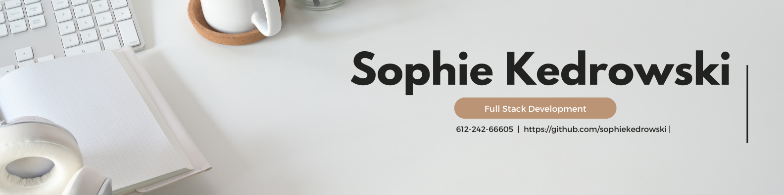

### Welcome to my github page!🍋

- Pronouns: She/Her 💁🏼‍♀️

### Currently looking for work as a full stack developer!🌟
- Currently enrolled at the University of Minnesota coding bootcamp 📱

- Working as observation unit nurse in St.Paul, Minnesota 🩺🩻

- In my free time you can find me rock climbing 🧗🏼‍♀️

### Follow me on social media to see what I am up too!

<!--
**sophiekedrowski/sophiekedrowski** is a ✨ _special_ ✨ repository because its `README.md` (this file) appears on your GitHub profile.

Here are some ideas to get you started:

- 🔭 I’m currently working on ...
- 🌱 I’m currently learning ...
- 👯 I’m looking to collaborate on ...
- 🤔 I’m looking for help with ...
- 💬 Ask me about ...
- 📫 How to reach me: ...
- 😄 Pronouns: ...
- ⚡ Fun fact: ...
-->
